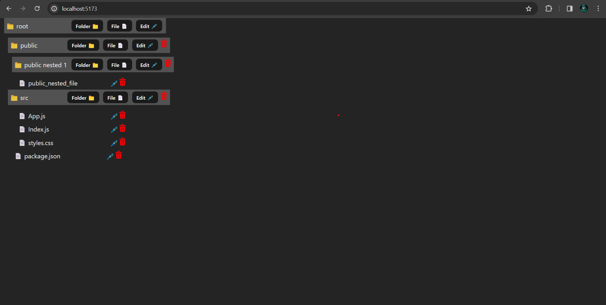
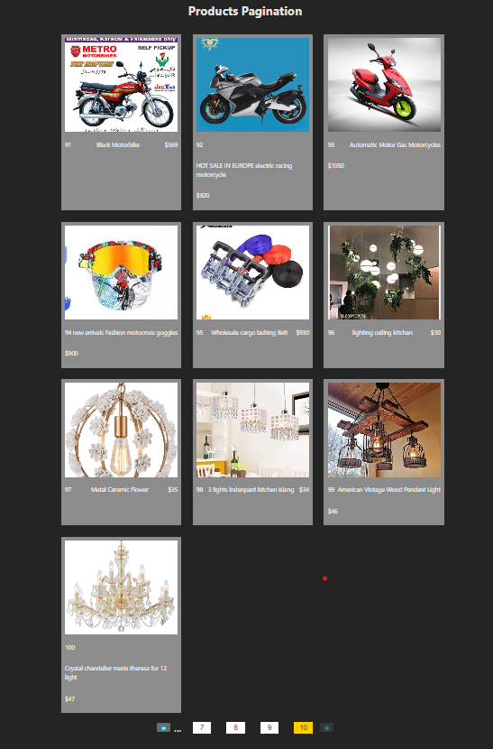
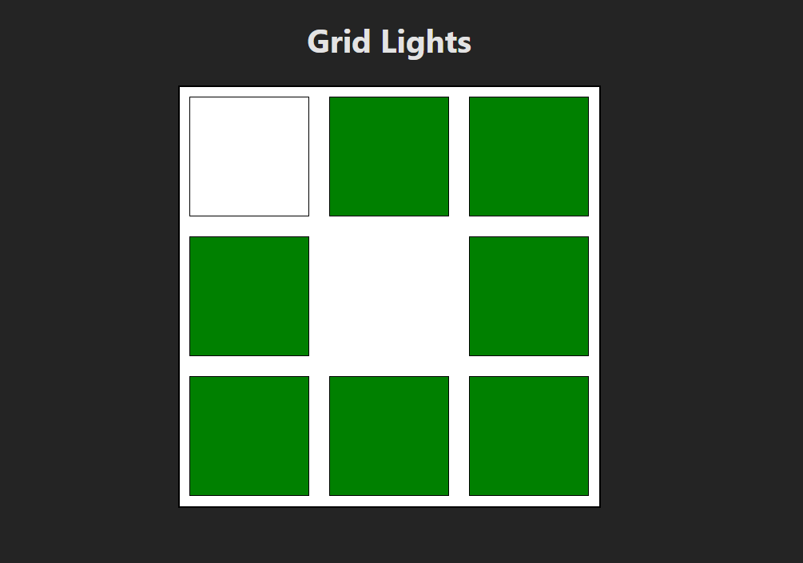

# ReactJS Interview Question

## 1. Create a File Explorer

### ScreenShot

---

## 2. Pagenation

Pagination in ReactJS refers to dividing a large set of data into smaller, more manageable portions or pages

### ScreenShot

## 

---

## 3. Grid_Lights

Build a grid of lights where the lights deactivate in the reverse order they were activated using React.

### ScreenShot

